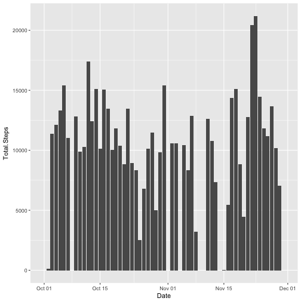
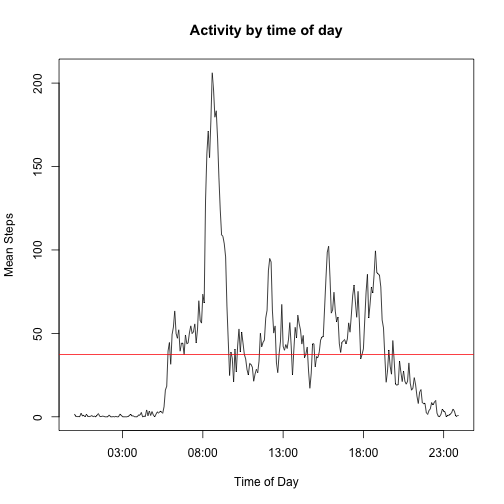
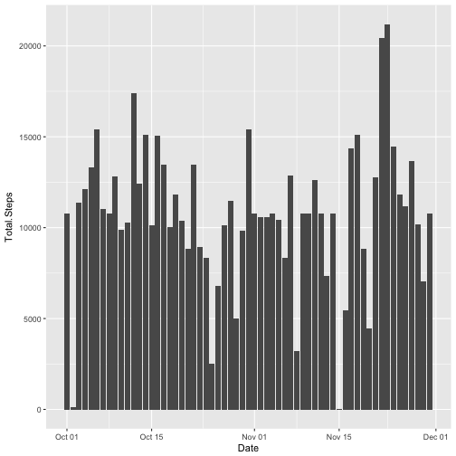
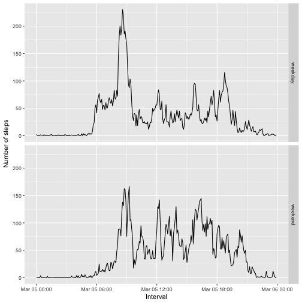

```r
---
output: 
  html_document:
title: "Reproducible Research: Peer Assessment 1"
---
```

```
## Error: <text>:7:0: unexpected end of input
## 5: ---
## 6: 
##   ^
```


## Loading and preprocessing the data

```r
library(ggplot2)
library(stringr)
if (!file.exists("./activity.zip")) {
  download.file("https://d396qusza40orc.cloudfront.net/repdata%2Fdata%2Factivity.zip", 
                "./activity.zip", "auto")
}
if (!file.exists("./activity.csv")) {
  unzip("./activity.zip")
}

activity <- read.csv("activity.csv")

summary(activity)
```

```
##      steps                date          interval     
##  Min.   :  0.00   2012-10-01:  288   Min.   :   0.0  
##  1st Qu.:  0.00   2012-10-02:  288   1st Qu.: 588.8  
##  Median :  0.00   2012-10-03:  288   Median :1177.5  
##  Mean   : 37.38   2012-10-04:  288   Mean   :1177.5  
##  3rd Qu.: 12.00   2012-10-05:  288   3rd Qu.:1766.2  
##  Max.   :806.00   2012-10-06:  288   Max.   :2355.0  
##  NA's   :2304     (Other)   :15840
```
## What is mean total number of steps taken per day?
First, calculating the total number of steps per day

```r
total_steps <- aggregate(activity$steps,list(as.Date(activity$date)), function(x) sum(x, na.rm = TRUE))
names(total_steps) <- c("Date","Total.Steps")
ggplot(total_steps, aes(Date, Total.Steps), ylab="Steps") + geom_histogram(stat="identity") + scale_x_date()
```

```
## Warning: Ignoring unknown parameters: binwidth, bins, pad
```



Given those totals, we can arrive at the mean and median values

```r
mean_steps <- mean(total_steps$Total.Steps, na.rm=TRUE)
median_steps <- median(total_steps$Total.Steps, na.rm=TRUE)
```

For this data set, the mean number of steps taken daily was 9354.2295082 per day and the median number of steps was 10395 per day.

## What is the average daily activity pattern?

```r
activity_intervals <- aggregate(activity$steps,list(str_pad(activity$interval, width=4,pad="0")), function(x) mean(x, na.rm=TRUE))
names(activity_intervals) <- c("Interval","Mean.Steps")
activity_intervals <- cbind(activity_intervals,Time=strptime(activity_intervals$Interval, format="%H%M"))
plot(data=activity_intervals, type="l", activity_intervals$Mean.Steps ~activity_intervals$Time, ylab="Mean Steps", xlab="Time of Day")
title("Activity by time of day")
abline(h=mean(activity_intervals$Mean.Steps), col="red")
```



```r
peak <- activity_intervals[which(activity_intervals$Mean.Steps == max(activity_intervals$Mean.Steps)), ]$Time
```

From this data, it appears that the maximum activity occurs at 08:35

## Imputing missing values

```r
missing_values <- sum(is.na.data.frame(activity))
missing_steps <- sum(is.na.data.frame(activity$steps))
```
The dataset has 2304 missing values. It appears that all of the missing values are in the steps count, with a total of 2304 missing values in that column.

To impute missing values, I considered using either the mean for the day, or the mean for the time interval. The problem with mean for the day is that there were entire days that were missing so I decided that the best approach was to use the mean for the time interval. 


```r
activity$imputed_steps <- activity_intervals$Mean.Steps
activity$steps <- ifelse(is.na(activity$steps), activity$imputed_steps, activity$steps) 
```

With the imputed values, the graph looks like this now


```r
total_steps_imputed <- aggregate(activity$steps,list(as.Date(activity$date)), function(x) sum(x, na.rm = TRUE))
names(total_steps_imputed) <- c("Date","Total.Steps")
ggplot(total_steps_imputed, aes(Date, Total.Steps), ylab="Steps") + geom_histogram(stat="identity") + scale_x_date()
```

```
## Warning: Ignoring unknown parameters: binwidth, bins, pad
```



```r
mean_steps_imputed <- mean(total_steps_imputed$Total.Steps, na.rm=TRUE)
median_steps_imputed <- median(total_steps_imputed$Total.Steps, na.rm=TRUE)
```

With the imputed values, the mean steps per day is now `mean_steps_imputed` and the median is now `median_steps_imputed`

## Are there differences in activity patterns between weekdays and weekends?

We will now classify the dates as weekday or weekend and graph the activity levels using those categories.


```r
activity$datetype <- ifelse(weekdays(as.Date(activity$date),abbreviate=TRUE) == "Sat" | weekdays(as.Date(activity$date),abbreviate=TRUE) == "Sun", "weekend","weekday")
activity$datetype <- as.factor(activity$datetype)
```

The final task is to create a panel plot containing a time series plot of the 5-minute interval and the average number of steps taken, averaged across all weekday days or weekend days. 


```r
mean_steps <- aggregate(activity$steps,list(str_pad(activity$interval, width=4,pad="0"), activity$datetype), function(steps) mean(steps, na.rm=TRUE))
names(mean_steps) <- c("Interval","Day.Type","Mean.Steps")
mean_steps <- cbind(mean_steps,Time=strptime(mean_steps$Interval, format="%H%M"))
ggplot(mean_steps, aes(Time, Mean.Steps)) + geom_line() + facet_grid(Day.Type ~ .) + labs(y="Number of steps", x="Interval")
```


```
```

